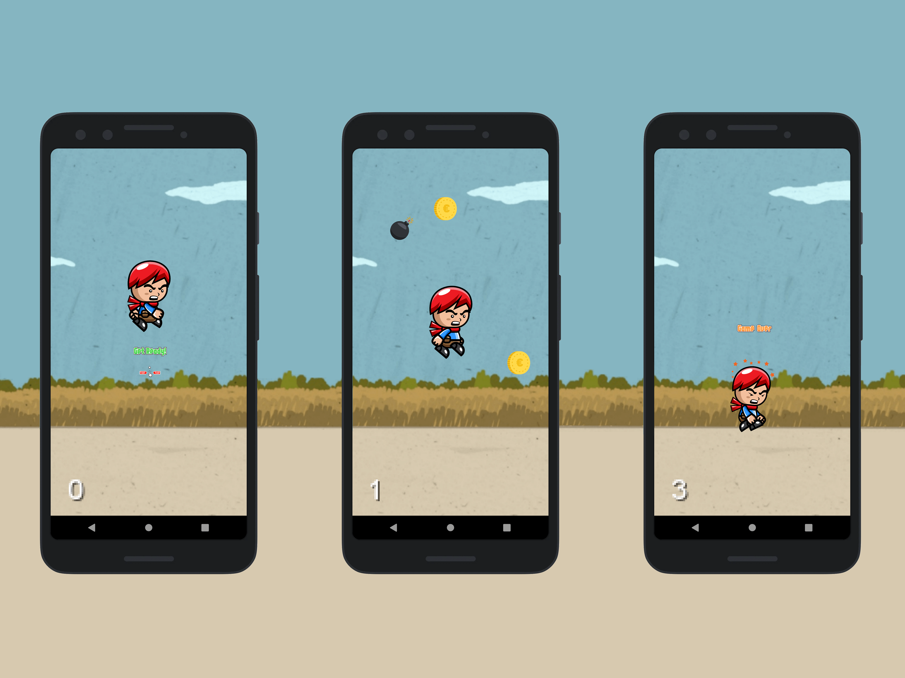

# Euro Man

Used technology: Kotlin, Game engine: libGDX

Android game Euro Man was inspired by Flappy Bird and Super Mario Run. The Squid Game series was also a great inspiration. The libGDX game engine was used in the development. The character in the game must collect "euro" coins and avoid bombs.

<a href="EuroMan.apk" download>
  Download APK
</a>
